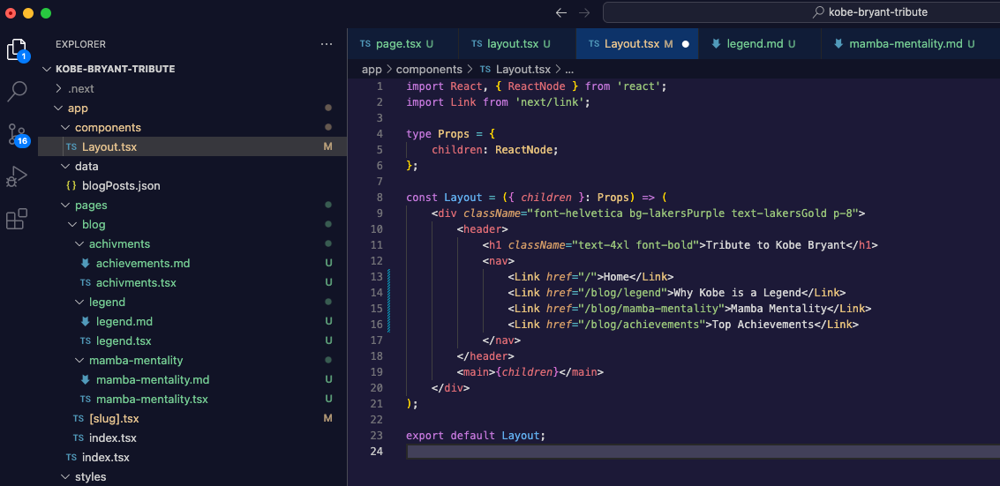

# GraphQL Editor Theme for VS Code.
The GraphQL Editor Theme is based on the color palette of GraphQL Editor in dark mode.
> 🪂 Bring new look and feel to your [Visual Studio Code](https://code.visualstudio.com) 🤩

---
### 📷 Preview screenshots!

---
### 🚀 Installation

Then paste the following command and press Enter:

```bash
ext install GraphQL Editor Theme
```
Launch Quick Open:

- Linux Ctrl + Shift + P
- macOS ⌘ + Shift + P
- Windows Ctrl + Shift + P

Type theme, choose `Preferences: Color Theme`, and select one of the **GraphQL Editor Theme** variants from the list. Well done!


> or

1. Go to **Extensions** in the VS Code Activity Bar (`View -> Extensions`)
2. Search for `GraphQL Editor Theme`
3. Click **Install** to install it
4. Set the theme as your active color theme (`Cmd + Shift + P -> Preferences: Color Theme -> GraphQL Editor Theme`)

From VS Code:

1. Go to **Extensions** in the VS Code Activity Bar (`View -> Extensions`)
2. Search for `GraphQL Editor Theme`
3. Click **Install** to install it
4. Set the theme as your active color theme (`Cmd + Shift + P -> Preferences: Color Theme -> GraphQL Editor Theme`)
---
### Override Theme Colors

You can override the **GraphQL Editor Theme** and schemes colors by adding theme-specific settings to your configuration. For advanced customisation please check the relative section on the [VS Code documentation](https://code.visualstudio.com/docs/getstarted/themes#_customizing-a-color-theme).

Something's missing ? Create Issues so that I can make the theme as compatible as possible ! ❤️ ;)

---
## Find us!

E-mail: [hello@graphqleditor.com](hello@graphqleditor.com 'Send an e-mail')\
Site: [https://graphqleditor.com](https://graphqleditor.com)  


#### If you like this project, let me know by leaving a star on this repository so I can keep improving this extension.

Best regards, GrapQL Editor.

---
## 📜 License

This theme pack extension is released under the MIT License.\
Copyright &copy; 2023 GraphQL Editor. All rights reserved.